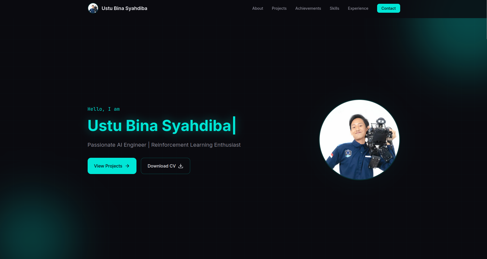
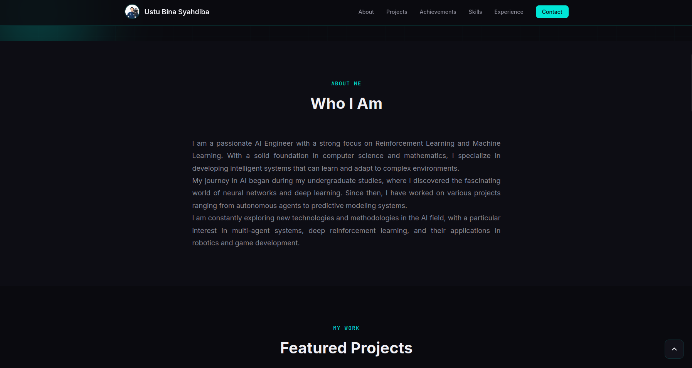
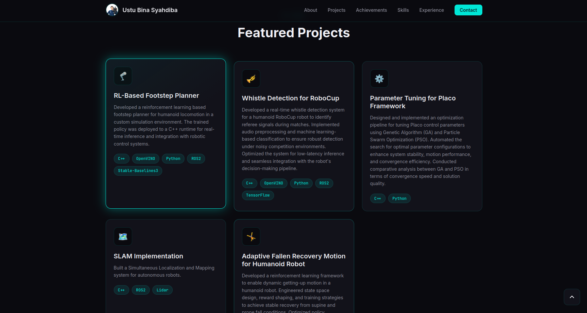
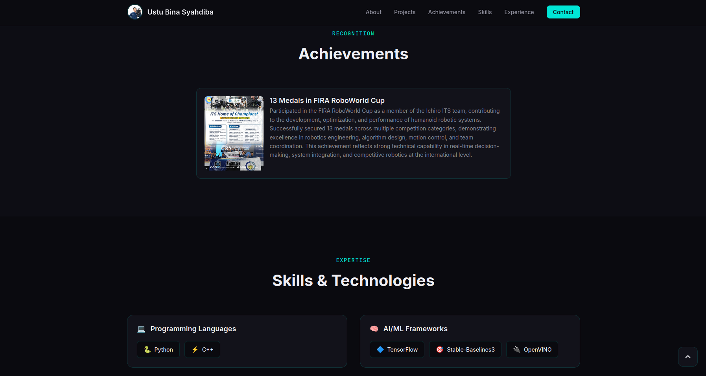
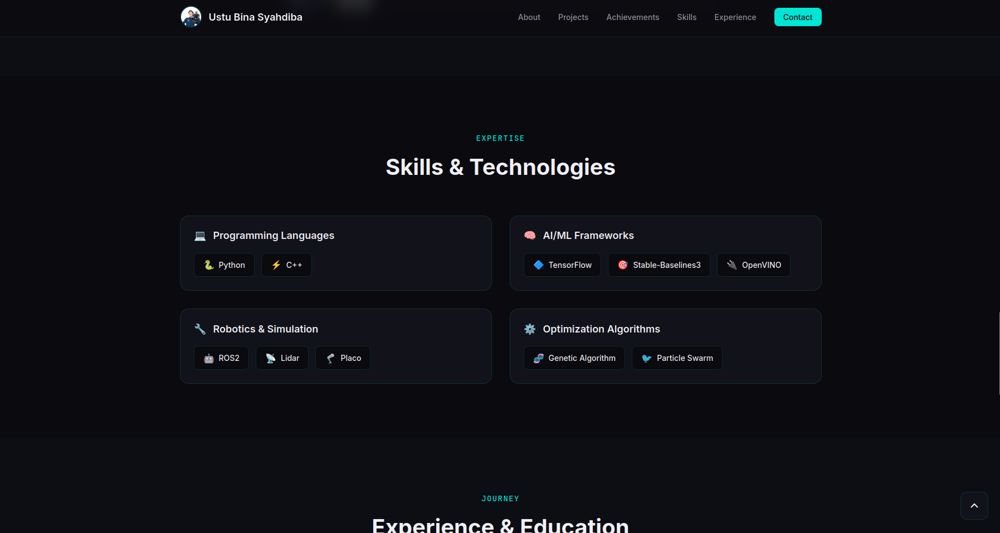
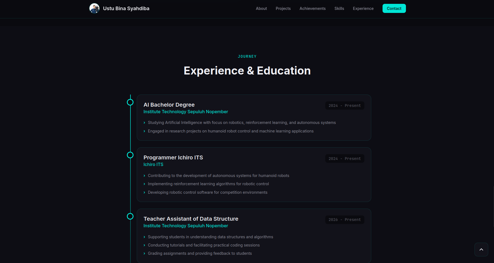
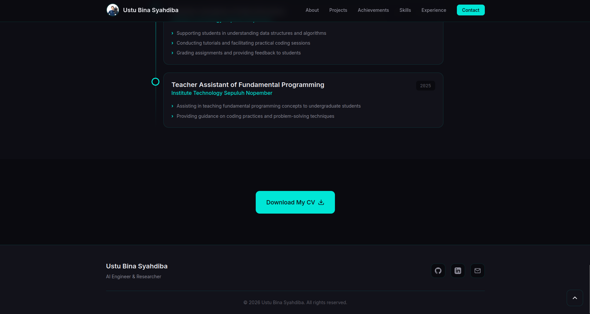

# Portofolio CV - Vanilla JS

Website portofolio CV dengan tema gelap dibuat menggunakan JavaScript murni, HTML5, dan CSS3.

---

## 📁 Struktur File

```
cv-portfolio-vanilla/
├── index.html              # File HTML utama
├── css/
│   └── style.css           # Semua style dengan variabel CSS
├── js/
│   └── main.js             # Semua fungsionalitas JavaScript
├── assets/
│   ├── images/             # Aset gambar
│   │   ├── FIRA.png
│   │   ├── profile.jpeg
│   │   └── resume.pdf
│   └── resume.pdf
└── README.md               # File ini
```

---

## 🎨 Penjelasan Section Web

Website ini terdiri dari beberapa section utama yang menampilkan informasi portofolio secara terstruktur:

### 🏠 Hero Section


Section pertama yang menyambut pengunjung dengan:
- Nama lengkap dengan efek mengetik
- Subtitle yang menjelaskan posisi/profesi
- Foto profil bulat dengan efek glow
- Tombol aksi: "View Projects" dan "Download CV"

### 👤 About Section


Section tentang diri yang berisi:
- Deskripsi singkat tentang latar belakang
- Keahlian utama
- Minat dan pengalaman dalam robotics dan machine learning

### 🚀 Projects Section


Section proyek yang menampilkan:
- Daftar proyek dalam format grid
- Setiap proyek memiliki ikon, judul, deskripsi, dan tag teknologi
- Proyek featured dengan efek glow
- Modal popup untuk detail proyek saat diklik

### 🏆 Achievements Section


Section pencapaian yang menunjukkan:
- Medali dan penghargaan yang diraih
- Deskripsi detail pencapaian
- Ikon trophy untuk setiap achievement

### 💻 Skills Section


Section keterampilan yang dikelompokkan menjadi:
- Programming Languages (Python, C++)
- AI/ML Frameworks (TensorFlow, Stable-Baselines3, OpenVINO)
- Robotics & Simulation (ROS2, Lidar, Placo)
- Optimization Algorithms (Genetic Algorithm, Particle Swarm)

### 📚 Experience Section


Section pengalaman yang menampilkan:
- Timeline pengalaman kerja dan pendidikan
- Posisi, perusahaan, dan periode waktu
- Bullet points detail tanggung jawab dan pencapaian
- Icon marker untuk setiap entry

### 📞 Contact Section


Section kontak untuk menghubungi:
- Tombol "Download My CV" untuk mengunduh resume
- Link sosial media (GitHub, LinkedIn, Email)

